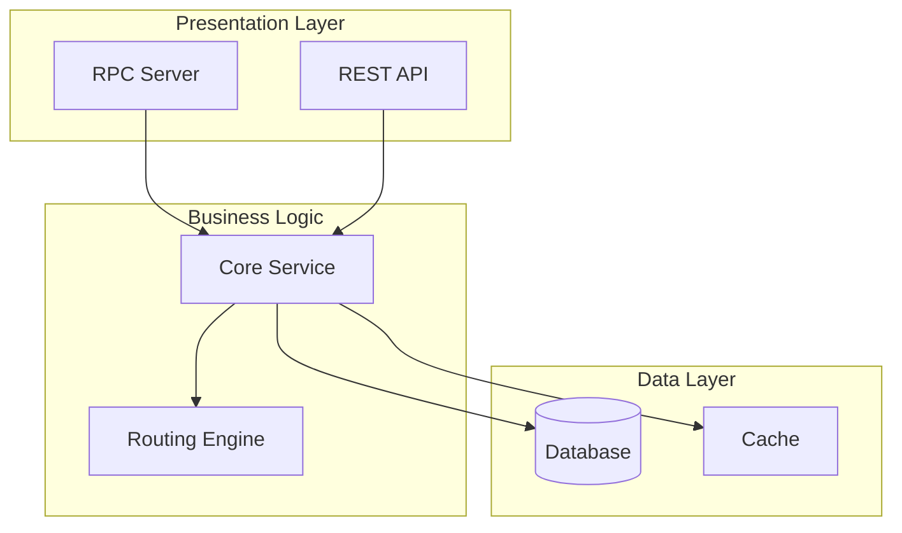
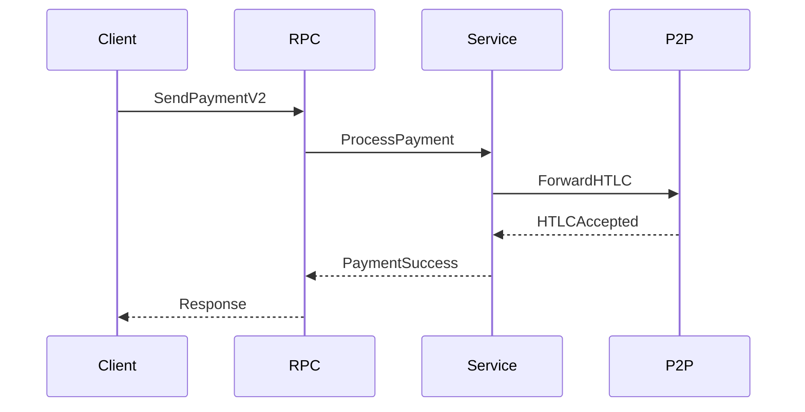
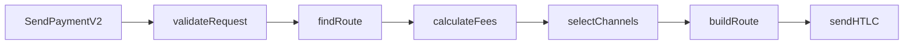

# Architecture Archaeologist Agent & Code Deep Dive Command

## Overview

The **architecture-archaeologist** agent is a specialized tool for performing comprehensive architectural analysis of codebases. It uses parallel sub-agents to investigate different aspects simultaneously and produces detailed markdown documentation with mermaid diagrams.

## Installation

The agent and command have been installed in:
- Agent: `.claude/agents/architecture-archaeologist.md`
- Command: `.claude/commands/code-deep-dive.md`

## Usage

### Using the Slash Command

The easiest way to trigger a deep dive is using the `/code-deep-dive` command:

```
/code-deep-dive Analyze the payment flow in lnd from SendPaymentV2 RPC call down to the p2p layer, including all intermediate steps and protocol interactions
```

### Direct Agent Invocation

You can also invoke the agent directly using the Task tool:

```
Use the architecture-archaeologist agent to investigate how the routing algorithm works in lnd, focusing on pathfinding, channel selection, and fee calculation
```

## Example Investigations

### 1. Payment Flow Analysis (Your Example)
```
/code-deep-dive Help me understand the way that payments flow in lnd. I want to understand the entire call graph, and also the sequences that occur between lnd and the other node, all the way down from RPC to the p2p layer. Focus on routerrpc SendPaymentV2. Call the final document payment_lifecycle.md
```

### 2. Database Architecture
```
/code-deep-dive Analyze the database layer architecture including schema, transactions, migrations, and query patterns. Focus on performance-critical paths.
```

### 3. API Surface Analysis
```
/code-deep-dive Document all public APIs, their dependencies, versioning strategy, and backward compatibility considerations.
```

### 4. Concurrency Model
```
/code-deep-dive Investigate the concurrency model including goroutines, channels, mutexes, and potential race conditions. Map out all concurrent execution paths.
```

## What the Agent Does

1. **Planning Phase**
   - Uses ultrathink for deep analysis
   - Creates a TodoWrite list of investigation areas
   - Identifies key components and boundaries

2. **Parallel Investigation**
   - Launches multiple Task agents simultaneously
   - Each agent focuses on a specific aspect:
     - Code structure and organization
     - Call graphs and dependencies
     - Data flow and transformations
     - APIs and interfaces
     - Patterns and design decisions

3. **Documentation Generation**
   - Each sub-agent creates its own markdown report
   - Reports include mermaid diagrams for visualization
   - All reports are preserved (not deleted)

4. **Synthesis**
   - Reads all sub-reports
   - Creates comprehensive final document
   - Generates unified overview diagrams
   - Cross-references between sections

## Output Structure

The agent produces:

### Intermediate Reports (kept in place)
- `component_analysis.md`
- `call_graph_analysis.md`
- `data_flow_analysis.md`
- `interface_documentation.md`
- `pattern_analysis.md`

### Final Synthesis Document
- Executive summary
- Detailed architectural analysis
- Comprehensive mermaid diagrams
- Dependency mappings
- Critical execution paths
- Recommendations (if applicable)

## Diagram Types Generated

### Architecture Overview


### Sequence Diagrams


### Call Graphs


## Tips for Best Results

1. **Be Specific**: Provide clear investigation focus and boundaries
2. **Request Diagrams**: Explicitly mention what visualizations you want
3. **Name Output**: Specify the final document name if you have a preference
4. **Mention Key Entry Points**: Include specific functions or modules to start from
5. **Scope Appropriately**: Balance between depth and breadth

## Customization

You can modify the agent behavior by editing `.claude/agents/architecture-archaeologist.md`:
- Adjust the system prompt
- Change tool permissions
- Modify diagram templates
- Update report structure

## Troubleshooting

If the agent doesn't produce expected results:
1. Ensure the codebase is accessible
2. Check that all required tools are available
3. Verify the investigation scope is clear
4. Look at intermediate reports for clues

## Advanced Usage

### Combining with Other Agents
```
First use architecture-archaeologist to map the system, then use security-auditor to analyze vulnerabilities in the identified critical paths
```

### Iterative Refinement
```
After the initial deep dive, request specific drill-downs into areas of interest using the intermediate reports as reference
```

### Cross-Repository Analysis
```
/code-deep-dive Analyze how this service integrates with external dependencies, mapping all API calls, data contracts, and failure modes
```