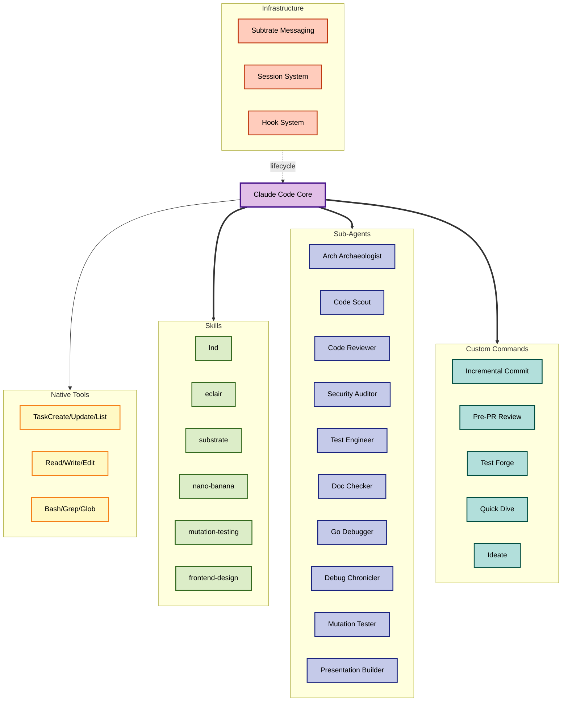

# Claude Code Configuration

An advanced Claude Code setup with specialized sub-agents, skills, custom commands, automated hooks, session management, and inter-agent messaging via Subtrate. Tailored for complex software engineering workflows, particularly Bitcoin/Lightning Network development.

## Architecture



## Skills

Domain-specific toolkits invoked via `/skill-name`:

| Skill | Description |
|-------|-------------|
| `lnd` | Lightning Network Daemon - Docker containers, RPC endpoints, channel management |
| `eclair` | ACINQ's Eclair - Docker containers, API endpoints, payment channels |
| `substrate` | Agent mail system - inbox, send, reply, identity management |
| `nano-banana` | AI image generation via Gemini/Imagen 3 |
| `mutation-testing` | Validate test quality through mutation analysis |
| `frontend-design` | Production-grade UI components with high design quality |
| `slide-creator` | Transform written content into slide deck images |
| `skill-creator` | Meta-skill for creating new skills |
| `lnget` | Lightning Network data retrieval |

## Sub-Agents

Specialized agents that run in separate context windows for deep analysis:

| Agent | Purpose |
|-------|---------|
| Architecture Archaeologist | Comprehensive codebase analysis with Mermaid diagrams |
| Code Scout | Fast targeted analysis (2-3 min), max 10 files |
| Code Reviewer | PR and code change review with pattern analysis |
| Security Auditor | Vulnerability identification and security hardening |
| Test Engineer | Test generation with property-based testing and fuzzing |
| Documentation Double-Checker | Verify documentation accuracy against codebase |
| Go Debugger | Interactive debugging with Delve and tmux |
| Debug Chronicler | Transform debugging sessions into structured runbooks |
| Mutation Tester | Mutation testing for code quality verification |
| Presentation Builder | Slide creation and presentation design |

## Custom Commands

Reusable workflows invoked by name:

| Category | Commands |
|----------|----------|
| **Analysis** | `/quick-dive`, `/code-deep-dive`, `/code-review`, `/focused-review` |
| **Testing** | `/test-forge`, `/fuzz-test`, `/mutation-testing` |
| **Review** | `/pre-pr-review`, `/batch-review`, `/security-review`, `/security-audit` |
| **Git** | `/incremental-commit`, `/resolve-pr-comments` |
| **Planning** | `/ideate`, `/issue-plan` |
| **Docs** | `/doc-check`, `/chronicle-fix` |
| **Sessions** | `/session-init`, `/session-resume`, `/session-log`, `/session-checkpoint`, `/session-pause`, `/session-close`, `/session-view` |

## Hooks

Shell scripts that execute at Claude Code lifecycle events:

### Substrate Hooks (Agent Messaging)
- **SessionStart**: Heartbeat + inject unread messages
- **UserPromptSubmit**: Silent heartbeat + check for new mail
- **Stop**: Long-poll 9m30s, keep agent alive for inter-agent work
- **SubagentStop**: One-shot mail check, then allow exit
- **PreCompact**: Save identity for restoration after compaction

### Context Hooks
- **SessionStart** (`load_project_context.sh`): Load project context and active sessions
- **UserPromptSubmit** (`context_enhancer.py`): Add intelligent context based on keywords
- **UserPromptSubmit** (`ultrathink_hook.py`): Enhanced reasoning when prompt ends with `-u`
- **PreCompact** (`save_important_context.sh`): Archive context before compaction

## Session Management

Sessions provide execution continuity across context compactions. When Claude's context window compacts, sessions preserve progress, decisions, and discoveries for seamless resumption.

```
/session-init  ->  (active work)  ->  /session-close --complete
                       |
                 (compaction)
                       |
               /session-resume
```

Key features:
- Per-project session tracking in `.sessions/` directories
- Automatic state preservation via PreCompact hook
- Structured logging: progress, decisions, discoveries, blockers
- Full documentation in [SESSIONS.md](SESSIONS.md)

## Subtrate Agent Messaging

[Subtrate](https://github.com/roasbeef/subtrate) is a command center for orchestrating multiple Claude Code agents. It solves two fundamental problems with Claude Code agents: **isolation** (agents have no way to communicate with each other) and **ephemerality** (agents lose identity and context when compaction occurs).

### Core Components

- **Substrated Daemon**: gRPC server (port 10009) + REST gateway + WebSocket hub + embedded Web UI
- **Substrate CLI**: Command-line client for mail operations, identity management, and polling
- **Hook Scripts**: Shell scripts in `~/.claude/hooks/substrate/` that integrate with Claude Code's lifecycle

### Key Features

- **Agent Identity**: Persistent, memorable codenames (e.g., "NobleLion", "SilverWolf") auto-generated on first use. Format: `CodeName@project.branch`. Survives across context compactions via PreCompact/SessionStart hook pair.
- **Mail System**: Async messaging between agents with thread-based conversations, priorities (urgent/normal/low), and per-recipient state tracking (inbox/archived/trash). Full-text search on message content.
- **Persistent Agent Pattern**: The Stop hook always outputs `{"decision": "block"}`, keeping the agent alive indefinitely. It long-polls for 9m30s checking for new messages, then loops. This means agents stay running and responsive to mail from other agents. Press Ctrl+C to force exit.
- **Web UI**: Real-time dashboard at http://localhost:8080 with agent status, activity feed, unread counts, and inbox management. WebSocket-powered live updates.
- **Heartbeat Tracking**: Agent liveness monitoring with status levels: active (<5min), idle (5-30min), offline (>30min). Heartbeats sent automatically by hooks on session start, prompt submit, and during stop polling.

### How Agents Communicate

```
Agent A starts -> SessionStart hook sends heartbeat, checks inbox
Agent A works  -> UserPromptSubmit hook sends heartbeat on each prompt
Agent A idles  -> Stop hook long-polls, discovers message from Agent B
                  -> Agent A reads mail, processes request, replies
Agent B sends  -> substrate send --to AgentA --subject "..." --body "..."
                  -> Message stored in SQLite, NotificationHub notifies
```

Subtrate is the **primary channel for reaching the user** and coordinating work across agents. When you need to send a status update or communicate asynchronously, use `substrate send` rather than just printing to the console.

## Directory Structure

```
~/.claude/
├── CLAUDE.md              # Global instructions for all projects
├── README.md              # This file
├── SESSIONS.md            # Session system documentation
├── settings.json          # Hooks, permissions, sandbox config
├── agents/                # Sub-agent definitions (10 agents)
├── commands/              # Custom command definitions
├── skills/                # Skill definitions (9 skills)
│   ├── lnd/
│   ├── eclair/
│   ├── substrate/
│   ├── nano-banana/
│   ├── mutation-testing/
│   ├── frontend-design/
│   ├── slide-creator/
│   ├── skill-creator/
│   └── lnget/
├── hooks/                 # Hook scripts
│   ├── substrate/         # Agent messaging hooks
│   ├── sessionstart/      # Session start hooks
│   ├── precompact/        # Pre-compaction hooks
│   └── userpromptsubmit/  # Prompt enhancement hooks
├── projects/              # Per-project configurations
├── plans/                 # Plan files from planning sessions
└── plugins/               # Plugin cache (LSPs, etc.)
```

## Getting Started

1. Clone to your home directory:
   ```bash
   cd ~ && git clone <repository-url> .claude
   ```

2. Make hook scripts executable:
   ```bash
   chmod +x ~/.claude/hooks/**/*.sh ~/.claude/hooks/**/*.py
   ```

3. Install Subtrate hooks:
   ```bash
   substrate hooks install
   ```

4. Review `settings.json` for hook paths, permissions, and sandbox configuration.

See the [Claude Code documentation](https://docs.anthropic.com/en/docs/claude-code/overview) for general setup and the [hooks guide](https://docs.anthropic.com/en/docs/claude-code/hooks-guide) for hook configuration.
