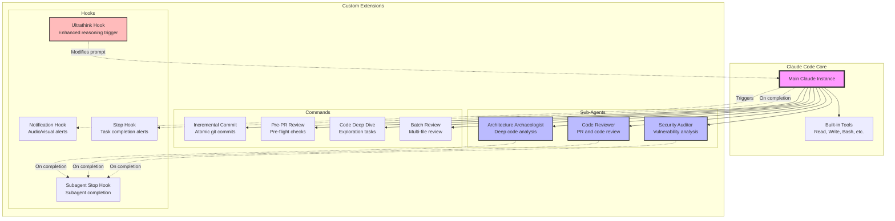

# Advanced Claude Code Configuration

This repository contains a sophisticated Claude Code setup that extends the base capabilities with specialized sub-agents, custom commands, and automated hooks. The configuration demonstrates how Claude Code can be transformed from a general-purpose AI assistant into a highly specialized development environment tailored for complex software engineering workflows.

## Overview

Claude Code is Anthropic's AI-powered development assistant that runs directly in your terminal. While powerful out of the box, its true potential emerges through customization. This configuration showcases an advanced setup that includes three key extension points: specialized sub-agents for deep code analysis, custom commands for common workflows, and hooks that provide real-time feedback and control.

The architecture leverages Claude Code's ability to spawn parallel sub-agents, each with their own context window and specialized expertise. This allows for complex, multi-threaded analysis while preserving the main conversation context. The system also includes automated notifications and a unique "ultrathink" hook that triggers enhanced reasoning for complex tasks.

## Architecture



## Components

### Sub-Agents

The configuration includes three specialized sub-agents, each designed for specific analytical tasks. These agents operate in separate context windows, allowing them to perform deep analysis without consuming the main conversation's context budget.

The **Architecture Archaeologist** (`agents/architecture-archaeologist.md`) serves as your codebase cartographer. When invoked, it launches multiple parallel investigations to analyze different aspects of your code simultaneously. It excels at generating comprehensive documentation with Mermaid diagrams, tracing call graphs, identifying architectural patterns, and synthesizing findings into cohesive reports. This agent is particularly valuable when onboarding new team members or documenting legacy systems.

The **Code Reviewer** (`agents/code-reviewer.md`) specializes in examining pull requests and code changes with the scrutiny of an experienced engineer. It analyzes not just the code itself but also the surrounding context, checking for consistency with existing patterns, identifying potential bugs, and suggesting improvements. The agent understands the nuances of distributed systems and can spot subtle issues that automated linters might miss.

The **Security Auditor** (`agents/security-auditor.md`) brings a security-first perspective to code analysis. It identifies vulnerabilities, reviews authentication flows, checks for common security antipatterns, and provides actionable recommendations. This agent is essential for maintaining secure coding practices and can be integrated into your development workflow as a pre-commit security check.

### Custom Commands

Commands extend Claude Code with reusable workflows that can be invoked with simple phrases. Each command is a carefully crafted prompt template that guides Claude through specific tasks.

The **Incremental Commit** command (`commands/incremental-commit.md`) transforms the often chaotic process of creating git commits into a structured workflow. Rather than dumping all changes into a single commit, it analyzes your modifications and creates atomic, well-documented commits that tell a coherent story. The command intelligently groups related changes, writes detailed commit messages in natural prose, and ensures each commit represents a logical unit of work.

The **Pre-PR Review** command (`commands/pre-pr-review.md`) acts as your personal code reviewer before you open a pull request. It checks for common issues, ensures tests pass, verifies documentation is updated, and provides a checklist of items to address. This preemptive review catches issues early, reducing review cycles and improving code quality.

Additional commands include **Code Deep Dive** for exploration tasks, **Batch Review** for analyzing multiple files simultaneously, **Security Audit** for focused security analysis, and **Fuzz Test** for generating test cases that explore edge conditions.

### Hooks System

The hooks system provides programmatic control over Claude Code's behavior through shell commands that execute at specific lifecycle events. This creates a feedback loop between Claude and your development environment.

The **Ultrathink Hook** (`hooks/ultrathink_hook.py`) implements an innovative prompt modification system. When you append `-u` to your message, it triggers enhanced reasoning mode by adding the "ultrathink" instruction to your prompt. This causes Claude to engage in deeper analysis before responding, particularly useful for complex architectural decisions or debugging challenging issues.

The **Notification System** uses macOS native features to provide audio and visual feedback. The enhanced notification script (`notify-enhanced.sh`) plays different sounds for different events and displays alerts with contextual information including the current directory and git branch. This keeps you informed of Claude's progress without constantly monitoring the terminal. The system triggers notifications when Claude sends messages, completes responses, or when sub-agents finish their tasks.

## Getting Started

To adopt this configuration for your own use, begin by understanding that Claude Code looks for customizations in the `.claude` directory. You can maintain both user-level configurations in `~/.claude/` and project-specific configurations in your project's `.claude/` directory.

First, ensure you have Claude Code installed and configured. If you haven't already, follow the [official quickstart guide](https://docs.anthropic.com/en/docs/claude-code/quickstart) to get Claude Code running on your system.

Clone this repository to your home directory to establish user-level configurations that will apply to all your Claude Code sessions:

```bash
cd ~
git clone [repository-url] .claude
```

The configuration uses shell scripts for hooks, which need to be executable:

```bash
chmod +x ~/.claude/notify-enhanced.sh
chmod +x ~/.claude/hooks/ultrathink_hook.py
```

Review and customize the `settings.json` file to match your preferences. Pay particular attention to the paths in the hooks configuration, as these need to point to the correct locations on your system. If you're not on macOS, you'll need to modify the notification scripts to use your platform's notification system.

## Usage Patterns

Once configured, these extensions integrate seamlessly into your Claude Code workflow. To use a sub-agent, you can either explicitly request it or let Claude automatically delegate based on the task. For instance, saying "Use the architecture archaeologist to analyze the payment processing system" will invoke the specialized agent for deep analysis.

Commands are triggered by mentioning them in your request. Saying "Help me create incremental commits for these changes" will activate the incremental commit workflow. Claude will analyze your changes, group them logically, and create atomic commits with detailed messages.

The ultrathink hook activates when you end your message with `-u`. This is particularly useful for complex problems where you want Claude to engage in deeper reasoning. For example, "Explain how this distributed lock mechanism prevents race conditions -u" will trigger enhanced analysis mode.

## Customization

This configuration serves as a foundation that you can extend based on your specific needs. Creating new sub-agents involves adding Markdown files to the `agents/` directory with appropriate YAML frontmatter defining the agent's capabilities and system prompt. The key is to make each agent focused on a specific domain while providing clear instructions about its responsibilities.

New commands follow a similar pattern in the `commands/` directory. Commands can specify which tools they're allowed to use, provide argument hints, and include detailed instructions for completing specific workflows. Think of commands as reusable prompt templates that encode best practices for common tasks.

Hooks can be any executable program that reads from stdin and writes to stdout. They receive contextual information as JSON and can modify or block Claude's actions. This provides a powerful extension point for integrating with your existing toolchain or enforcing project-specific policies.

## Advanced Workflows

The true power of this configuration emerges when components work together. Consider a typical feature development workflow: you might start by using the architecture archaeologist to understand the existing system, implement your changes with Claude's assistance, use the security auditor to check for vulnerabilities, run the pre-PR review command to ensure quality, and finally use the incremental commit command to create a clean git history.

For code reviews, you might invoke the code reviewer agent on a pull request, have it identify issues, then use Claude's main context to implement fixes, with the notification system keeping you informed of progress throughout. The ultrathink mode can be engaged when the reviewer encounters particularly complex logic that requires deeper analysis.

## Performance Considerations

Sub-agents operate in separate context windows, which means they don't consume the main conversation's token budget. This allows for extensive analysis without losing your conversation history. However, each sub-agent invocation does count against your usage limits, so it's important to use them judiciously.

The parallel execution capability of sub-agents can significantly reduce wall-clock time for complex analyses. When the architecture archaeologist launches multiple investigation threads, they run concurrently rather than sequentially, providing comprehensive results more quickly.

Hooks execute synchronously and can impact response times if they perform expensive operations. Keep hook scripts lightweight and focused. The notification system, for example, plays sounds asynchronously to avoid blocking Claude's response.

## Integration with Development Workflows

This configuration is designed to integrate smoothly with existing development practices. The git-aware commands understand your repository structure and follow your project's commit conventions. The notification system respects your focus by providing unobtrusive alerts rather than interrupting your flow.

For teams, consider maintaining a shared `.claude/` directory in your project repository. This ensures all team members have access to the same specialized agents and commands, creating consistency in how Claude Code is used across your organization. You can even create project-specific agents that understand your unique architecture and coding standards.

## Security Considerations

Hooks run with your environment's credentials, so review any hook scripts carefully before installation. The configuration intentionally uses simple, auditable scripts rather than complex programs. Never install hooks from untrusted sources, as they have full access to your system within the permissions of your user account.

Sub-agents and commands operate within Claude Code's security model, with access only to the tools specified in their configuration. This provides defense in depth, ensuring that specialized agents can't perform actions outside their intended scope.

## Further Resources

To deepen your understanding of Claude Code's capabilities, explore the [official documentation](https://docs.anthropic.com/en/docs/claude-code/overview). The [sub-agents guide](https://docs.anthropic.com/en/docs/claude-code/sub-agents) provides detailed information about creating and managing specialized agents. The [hooks guide](https://docs.anthropic.com/en/docs/claude-code/hooks-guide) explains the complete hooks API and lifecycle events.

For inspiration on extending this configuration, consider your most common development tasks and pain points. Claude Code's extensibility means you can encode your team's best practices, automate repetitive workflows, and create a development environment that actively assists rather than passively responds.

## Conclusion

This configuration demonstrates how Claude Code can be transformed from a capable AI assistant into a comprehensive development platform. Through the thoughtful application of sub-agents, commands, and hooks, you can create an environment where AI augmentation becomes a natural part of your development workflow rather than an external tool.

The modular nature of these extensions means you can adopt them incrementally, starting with the components most relevant to your work and expanding as you discover new use cases. Whether you're exploring unfamiliar codebases, maintaining complex systems, or striving for higher code quality, this configuration provides the foundation for AI-enhanced development that adapts to your needs rather than forcing you to adapt to it.