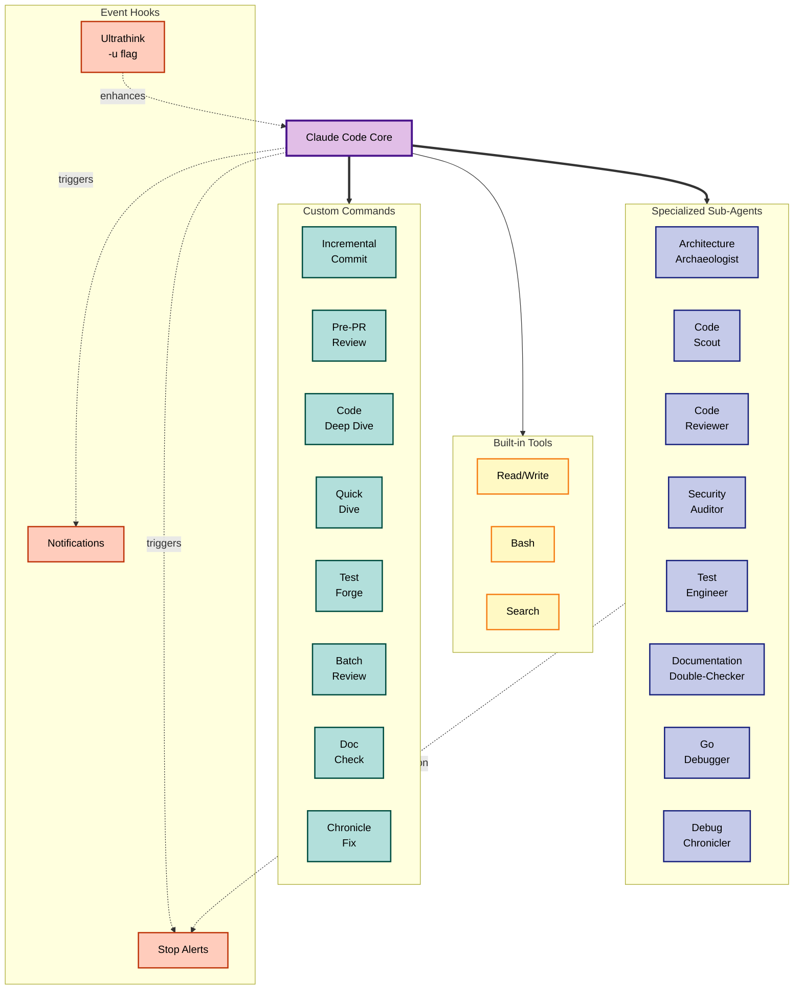

# Advanced Claude Code Configuration

This repository contains a sophisticated Claude Code setup that extends the base capabilities with specialized sub-agents, custom commands, and automated hooks. The configuration demonstrates how Claude Code can be transformed from a general-purpose AI assistant into a highly specialized development environment tailored for complex software engineering workflows.

## Overview

Claude Code is Anthropic's AI-powered development assistant that runs directly in your terminal. While powerful out of the box, its true potential emerges through customization. This configuration showcases an advanced setup that includes three key extension points: specialized sub-agents for deep code analysis, custom commands for common workflows, and hooks that provide real-time feedback and control.

The architecture leverages Claude Code's ability to spawn parallel sub-agents, each with their own context window and specialized expertise. This allows for complex, multi-threaded analysis while preserving the main conversation context. The system also includes automated notifications and a unique "ultrathink" hook that triggers enhanced reasoning for complex tasks.

## Architecture



## Components

### Sub-Agents

The configuration includes eight specialized sub-agents, each designed for specific analytical tasks. These agents operate in separate context windows, allowing them to perform deep analysis without consuming the main conversation's context budget.

#### Architecture Archaeologist

The **Architecture Archaeologist** (`agents/architecture-archaeologist.md`) serves as your codebase cartographer. When invoked, it launches multiple parallel investigations to analyze different aspects of your code simultaneously. It excels at generating comprehensive documentation with Mermaid diagrams, tracing call graphs, identifying architectural patterns, and synthesizing findings into cohesive reports. This agent is particularly valuable when onboarding new team members or documenting legacy systems.

#### Code Scout

The **Code Scout** (`agents/code-scout.md`) is the speed-focused counterpart to the Architecture Archaeologist. When you need quick answers about specific code areas without waiting for comprehensive analysis, the Code Scout delivers targeted insights in 2-3 minutes. It operates with strict constraints: analyzing a maximum of 10 files, producing summaries under 1000 words, and focusing only on what's necessary to answer your specific question. This agent is ideal for debugging sessions, quick code navigation, or understanding specific flows without the overhead of deep architectural analysis.

#### Code Reviewer

The **Code Reviewer** (`agents/code-reviewer.md`) specializes in examining pull requests and code changes with the scrutiny of an experienced engineer. It analyzes not just the code itself but also the surrounding context, checking for consistency with existing patterns, identifying potential bugs, and suggesting improvements. The agent understands the nuances of distributed systems and can spot subtle issues that automated linters might miss.

#### Security Auditor

The **Security Auditor** (`agents/security-auditor.md`) brings a security-first perspective to code analysis. It identifies vulnerabilities, reviews authentication flows, checks for common security antipatterns, and provides actionable recommendations. This agent is essential for maintaining secure coding practices and can be integrated into your development workflow as a pre-commit security check.

#### Test Engineer

The **Test Engineer** (`agents/test-engineer.md`) specializes in comprehensive test generation using advanced techniques. It analyzes code coverage to identify gaps, creates property-based tests using the rapid framework, designs sophisticated fuzz tests that go beyond simple encode/decode, and builds reusable test harnesses for maintainability. The agent can both generate new test suites from scratch and enhance existing tests, using multiple refinement passes to optimize test quality and coverage. It's particularly effective for complex business logic, state machines, and systems requiring high reliability.

#### Documentation Double-Checker

The **Documentation Double-Checker** (`agents/documentation-double-checker.md`) ensures documentation accuracy by verifying all claims against the actual codebase. It launches parallel verification agents to check file paths, function signatures, code examples, architectural descriptions, and mermaid diagrams. When discrepancies are found, it automatically generates corrected versions and provides detailed verification reports. This agent is automatically invoked by the Architecture Archaeologist after documentation generation, but can also be used standalone to verify existing documentation.

#### Go Debugger

The **Go Debugger** (`agents/go-debugger.md`) provides interactive debugging capabilities for Go programs using Delve (dlv) and tmux. It creates isolated debugging sessions where it can set breakpoints, step through code, inspect variables and goroutines, and analyze program state in real-time. The agent uses sophisticated event-based synchronization with `tmux wait-for` signals and file-based output monitoring to maintain tight control over the debugging session. This eliminates the need for brittle sleep-based timing and provides reliable command execution. It's particularly effective for debugging complex concurrency issues, nil pointer dereferences, and goroutine deadlocks in Go applications.

#### Debug Chronicler

The **Debug Chronicler** (`agents/debug-chronicler.md`) transforms ad-hoc debugging sessions into structured, reusable runbooks. After resolving a bug, this agent analyzes the entire conversation transcript to extract the debugging journey and create comprehensive documentation that helps future developers facing similar issues. It generates structured runbooks with symptom checklists, diagnostic flowcharts using Mermaid diagrams, step-by-step resolution paths, and verification procedures. Each runbook follows a consistent template that makes it easy to quickly identify if you're facing the same issue and provides proven resolution strategies.

### Custom Commands

Commands extend Claude Code with reusable workflows that can be invoked with simple phrases. Each command is a carefully crafted prompt template that guides Claude through specific tasks.

#### Incremental Commit

The **Incremental Commit** command (`commands/incremental-commit.md`) transforms the often chaotic process of creating git commits into a structured workflow. Rather than dumping all changes into a single commit, it analyzes your modifications and creates atomic, well-documented commits that tell a coherent story. The command intelligently groups related changes, writes detailed commit messages in natural prose, and ensures each commit represents a logical unit of work.

#### Pre-PR Review

The **Pre-PR Review** command (`commands/pre-pr-review.md`) acts as your personal code reviewer before you open a pull request. It checks for common issues, ensures tests pass, verifies documentation is updated, and provides a checklist of items to address. This preemptive review catches issues early, reducing review cycles and improving code quality.

#### Code Deep Dive

The **Code Deep Dive** command provides comprehensive exploration of complex codebases. It performs exhaustive analysis to understand architectural patterns, dependencies, and system behaviors, producing detailed reports with diagrams and documentation.

#### Quick Dive

The **Quick Dive** command (`commands/quick-dive.md`) is the fast-track alternative for targeted analysis. Using the Code Scout agent, it delivers focused insights in 2-3 minutes. This command is particularly useful when you need immediate answers about specific code functionality without the overhead of a full architectural analysis.

#### Test Forge

The **Test Forge** command (`commands/test-forge.md`) leverages the Test Engineer agent to create sophisticated test suites. It combines property-based testing, advanced fuzzing, and coverage-guided generation to produce comprehensive test coverage that goes beyond simple unit tests.

#### Batch Review

The **Batch Review** command enables analyzing multiple files simultaneously, perfect for reviewing related changes across a codebase or ensuring consistency in implementation patterns across multiple components.

#### Security Audit

The **Security Audit** command provides focused security analysis of code sections, identifying vulnerabilities, checking authentication flows, and suggesting security improvements.

#### Fuzz Test

The **Fuzz Test** command generates test cases that explore edge conditions and unexpected inputs, helping identify bugs that standard testing might miss.

#### Doc Check

The **Doc Check** command (`commands/doc-check.md`) verifies documentation accuracy against the actual codebase. It can verify an entire documentation folder or specific markdown files, ensuring all technical documentation accurately reflects the implementation.

#### Chronicle Fix

The **Chronicle Fix** command (`commands/chronicle-fix.md`) invokes the Debug Chronicler agent to analyze the current conversation and create a structured debugging runbook. This transforms one-off bug fixes into institutional knowledge that benefits the entire team, ensuring that debugging insights are preserved and reusable.

### Hooks System

The hooks system provides programmatic control over Claude Code's behavior through shell commands that execute at specific lifecycle events. This creates a feedback loop between Claude and your development environment.

#### Ultrathink Hook

The **Ultrathink Hook** (`hooks/ultrathink_hook.py`) implements an innovative prompt modification system. When you append `-u` to your message, it triggers enhanced reasoning mode by adding the "ultrathink" instruction to your prompt. This causes Claude to engage in deeper analysis before responding, particularly useful for complex architectural decisions or debugging challenging issues.

#### Notification System

The **Notification System** uses macOS native features to provide audio and visual feedback. The enhanced notification script (`notify-enhanced.sh`) plays different sounds for different events and displays alerts with contextual information including the current directory and git branch. This keeps you informed of Claude's progress without constantly monitoring the terminal. The system triggers notifications when Claude sends messages, completes responses, or when sub-agents finish their tasks.

## Getting Started

To adopt this configuration for your own use, begin by understanding that Claude Code looks for customizations in the `.claude` directory. You can maintain both user-level configurations in `~/.claude/` and project-specific configurations in your project's `.claude/` directory.

First, ensure you have Claude Code installed and configured. If you haven't already, follow the [official quickstart guide](https://docs.anthropic.com/en/docs/claude-code/quickstart) to get Claude Code running on your system.

Clone this repository to your home directory to establish user-level configurations that will apply to all your Claude Code sessions:

```bash
cd ~
git clone [repository-url] .claude
```

The configuration uses shell scripts for hooks, which need to be executable:

```bash
chmod +x ~/.claude/notify-enhanced.sh
chmod +x ~/.claude/hooks/ultrathink_hook.py
```

Review and customize the `settings.json` file to match your preferences. Pay particular attention to the paths in the hooks configuration, as these need to point to the correct locations on your system. If you're not on macOS, you'll need to modify the notification scripts to use your platform's notification system.

## Usage Patterns

Once configured, these extensions integrate seamlessly into your Claude Code workflow. To use a sub-agent, you can either explicitly request it or let Claude automatically delegate based on the task. For instance, saying "Use the architecture archaeologist to analyze the payment processing system" will invoke the specialized agent for deep analysis.

Commands are triggered by mentioning them in your request. Saying "Help me create incremental commits for these changes" will activate the incremental commit workflow. Claude will analyze your changes, group them logically, and create atomic commits with detailed messages.

### Choosing Between Quick Dive and Deep Dive

The configuration offers two complementary approaches for code analysis:

**Use Quick Dive (`/quick-dive`) when:**
- You need an answer in 2-3 minutes
- Your question is specific and focused ("How does X work?")
- You're debugging and need to understand a particular flow
- You want to quickly navigate to relevant code
- Time is more important than exhaustiveness

**Use Code Deep Dive (`/code-deep-dive`) when:**
- You need comprehensive documentation
- You're analyzing complex multi-system interactions
- You're onboarding team members to a codebase
- You want detailed architectural diagrams
- Thoroughness is more important than speed

For example, `/quick-dive How does user authentication work?` will give you a focused answer in minutes, while `/code-deep-dive Analyze the entire authentication and authorization architecture` will provide comprehensive documentation with multiple diagrams and reports.

### Advanced Test Generation with Test Forge

The Test Forge command revolutionizes test creation by combining multiple advanced testing techniques:

**Use Test Forge (`/test-forge`) to:**
- Generate comprehensive test suites with coverage guidance
- Create property-based tests that verify invariants
- Design advanced fuzz tests for state machines and business logic
- Build reusable test harnesses for maintainability
- Enhance existing tests or create new ones from scratch

**Example workflows:**
```bash
# Generate tests for a new feature
/test-forge PaymentProcessor

# Enhance existing tests with property-based testing
/test-forge BinaryTree.Insert "add property tests"

# Focus on specific testing aspects
/test-forge ConnectionPool "focus on concurrent operations and race conditions"
```

The Test Engineer agent will analyze existing tests (if any), identify coverage gaps, and generate sophisticated tests using the rapid property-based testing framework. It performs multiple refinement passes to optimize test quality and ensure comprehensive coverage.

The ultrathink hook activates when you end your message with `-u`. This is particularly useful for complex problems where you want Claude to engage in deeper reasoning. For example, "Explain how this distributed lock mechanism prevents race conditions -u" will trigger enhanced analysis mode.

## Customization

This configuration serves as a foundation that you can extend based on your specific needs. Creating new sub-agents involves adding Markdown files to the `agents/` directory with appropriate YAML frontmatter defining the agent's capabilities and system prompt. The key is to make each agent focused on a specific domain while providing clear instructions about its responsibilities.

New commands follow a similar pattern in the `commands/` directory. Commands can specify which tools they're allowed to use, provide argument hints, and include detailed instructions for completing specific workflows. Think of commands as reusable prompt templates that encode best practices for common tasks.

Hooks can be any executable program that reads from stdin and writes to stdout. They receive contextual information as JSON and can modify or block Claude's actions. This provides a powerful extension point for integrating with your existing toolchain or enforcing project-specific policies.

## Advanced Workflows

The true power of this configuration emerges when components work together. Consider a typical feature development workflow: you might start by using the architecture archaeologist to understand the existing system, implement your changes with Claude's assistance, use the security auditor to check for vulnerabilities, run the pre-PR review command to ensure quality, and finally use the incremental commit command to create a clean git history.

For documentation workflows, the Architecture Archaeologist now automatically invokes the Documentation Double-Checker after generating documentation, ensuring accuracy. You can also use the `/doc-check` command independently to verify existing documentation:

```bash
# Verify all documentation in a folder
/doc-check ./docs

# Verify specific files
/doc-check README.md ARCHITECTURE.md API.md
```

This creates a virtuous cycle where documentation generation and verification work together to maintain high-quality, accurate technical documentation.

For code reviews, you might invoke the code reviewer agent on a pull request, have it identify issues, then use Claude's main context to implement fixes, with the notification system keeping you informed of progress throughout. The ultrathink mode can be engaged when the reviewer encounters particularly complex logic that requires deeper analysis.

For debugging workflows, the Go Debugger agent provides a powerful interactive debugging experience. When encountering a bug in Go code, you can invoke the agent to create a tmux debugging session where you can set breakpoints, step through code, and inspect program state in real-time. After successfully resolving the issue, use the `/chronicle-fix` command to have the Debug Chronicler analyze the debugging session and create a structured runbook. This transforms your debugging experience into reusable knowledge that helps the entire team resolve similar issues faster in the future. The combination of interactive debugging and automatic documentation creation ensures that no debugging insight is lost.

## Performance Considerations

Sub-agents operate in separate context windows, which means they don't consume the main conversation's token budget. This allows for extensive analysis without losing your conversation history. However, each sub-agent invocation does count against your usage limits, so it's important to use them judiciously.

The parallel execution capability of sub-agents can significantly reduce wall-clock time for complex analyses. When the architecture archaeologist launches multiple investigation threads, they run concurrently rather than sequentially, providing comprehensive results more quickly.

Hooks execute synchronously and can impact response times if they perform expensive operations. Keep hook scripts lightweight and focused. The notification system, for example, plays sounds asynchronously to avoid blocking Claude's response.

## Integration with Development Workflows

This configuration is designed to integrate smoothly with existing development practices. The git-aware commands understand your repository structure and follow your project's commit conventions. The notification system respects your focus by providing unobtrusive alerts rather than interrupting your flow.

For teams, consider maintaining a shared `.claude/` directory in your project repository. This ensures all team members have access to the same specialized agents and commands, creating consistency in how Claude Code is used across your organization. You can even create project-specific agents that understand your unique architecture and coding standards.

## Security Considerations

Hooks run with your environment's credentials, so review any hook scripts carefully before installation. The configuration intentionally uses simple, auditable scripts rather than complex programs. Never install hooks from untrusted sources, as they have full access to your system within the permissions of your user account.

Sub-agents and commands operate within Claude Code's security model, with access only to the tools specified in their configuration. This provides defense in depth, ensuring that specialized agents can't perform actions outside their intended scope.

## Further Resources

To deepen your understanding of Claude Code's capabilities, explore the [official documentation](https://docs.anthropic.com/en/docs/claude-code/overview). The [sub-agents guide](https://docs.anthropic.com/en/docs/claude-code/sub-agents) provides detailed information about creating and managing specialized agents. The [hooks guide](https://docs.anthropic.com/en/docs/claude-code/hooks-guide) explains the complete hooks API and lifecycle events.

For inspiration on extending this configuration, consider your most common development tasks and pain points. Claude Code's extensibility means you can encode your team's best practices, automate repetitive workflows, and create a development environment that actively assists rather than passively responds.

## Conclusion

This configuration demonstrates how Claude Code can be transformed from a capable AI assistant into a comprehensive development platform. Through the thoughtful application of sub-agents, commands, and hooks, you can create an environment where AI augmentation becomes a natural part of your development workflow rather than an external tool.

The modular nature of these extensions means you can adopt them incrementally, starting with the components most relevant to your work and expanding as you discover new use cases. Whether you're exploring unfamiliar codebases, maintaining complex systems, or striving for higher code quality, this configuration provides the foundation for AI-enhanced development that adapts to your needs rather than forcing you to adapt to it.